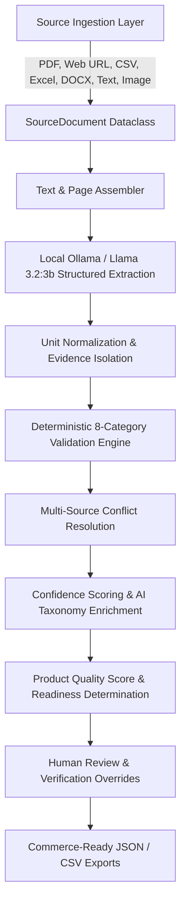

# ProductIQ AI Architecture Documentation

## System Overview
ProductIQ AI transforms unstructured, multi-source industrial product data into validated, explainable, evidence-backed, and commerce-ready product intelligence.

## Core Modules & Components

1. **Ingestion Manager (`backend/ingestion/`)**:
   - `base.py`: Adapter base class (`BaseSourceAdapter`) and custom `IngestionError`.
   - `pdf.py`: Page-by-page extraction and PDF metadata tracking using PyMuPDF (`fitz`).
   - `web.py`: Public HTTP/HTTPS web page scraping with BeautifulSoup & `httpx`. Contains SSRF security guards.
   - `csv.py` & `excel.py`: Tabular catalog parsing with pandas and openpyxl.
   - `docx.py`: Paragraph, heading, and table extraction with python-docx.
   - `text.py`: Plain text and Markdown file ingestion.
   - `image.py`: Optional local OCR with pytesseract.
   - `manager.py`: Master orchestrator supporting multi-source combinations.

2. **Extraction Engine (`backend/extraction.py`)**:
   - Strict anti-hallucination prompt engineering instructing the local model to extract only verbatim facts or explicitly return `null`.
   - Local fallback to conservative deterministic line extraction when Ollama is offline.

3. **Normalization & Evidence Traceability (`backend/normalization.py`, `backend/evidence.py`)**:
   - Normalizes common units (`mm`, `bar`, `°C`, `kg`, `V`, `A`, `kW`, `m/s`, `rpm`, etc.).
   - Isolates exact verbatim text quotes and attributes page numbers for 100% explainable AI.

4. **Validation Engine (`backend/validation.py`)**:
   - 8 deterministic validation check categories: Required Fields, Unit Consistency, Numeric Format, Sanity Ranges, Duplicate Attributes, Recommended Specs, Electrical Logical Consistency ($P = V \times I$), and Cross-Source Conflicts.

5. **Confidence & Product Quality Scoring (`backend/confidence.py`, `backend/scoring.py`)**:
   - Attribute confidence calculated based on page attribution, verbatim snippet score, unit standardization, and validation flags.
   - Overall Product Quality Score (0-100) across Completeness, Extraction, Validation, Evidence, and Consistency.
